# Weekly Retail Insights — On Autopilot

## The problem

You have sales data, but no time to look at it. Most business owners glance at last month's revenue and move on. The stuff that actually matters (which products are slipping, which customers are going quiet, which weeks quietly outperform the rest) just gets missed.

## How it works

**1. Your Data, Always Up to Date**
You connect the latest sales data, for example via Google Sheets.

**2. Automatic Analysis**
Every week, the system reads your data, analyzes it, and builds the summary report & charts — revenue trends, top products, customer behaviour. This is all automated: No one needs to touch anything.

**3. Custom Report, automatically delivered to your email or chat**
After the weekly automatic analysis, a clean PDF containing your custom report gets generated.
This report can be customized to your liking and can be automatically sent to your email, Teams, Slack, etc.

## See it in action

[View a sample report (PDF)](output/report_sample.pdf)

## Interested?

This is currently a pilot. If you want a report built around your own data, please feel free to get in touch.
**Contact:** nguyenandydevjp@gmail.com
