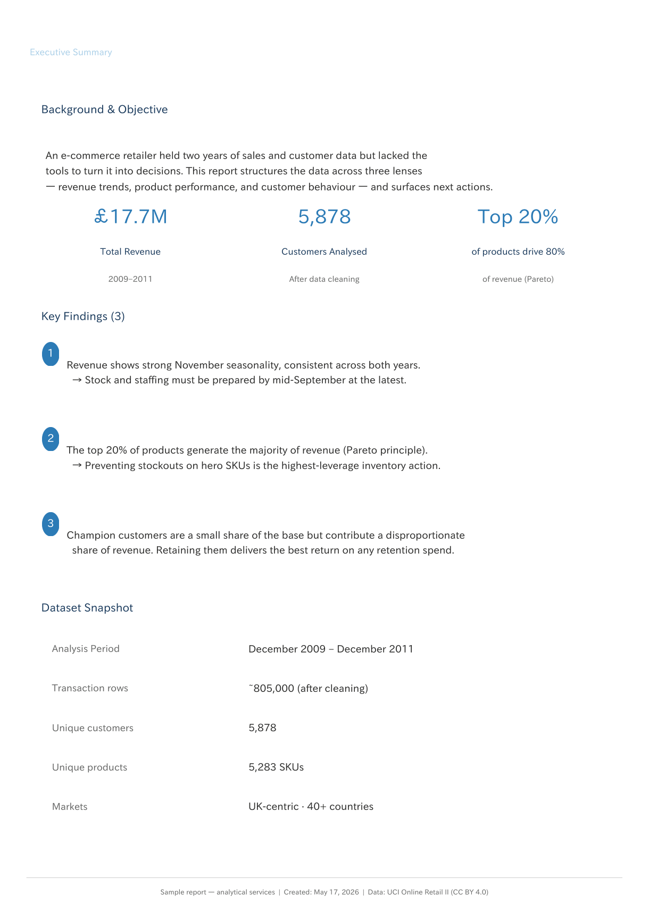
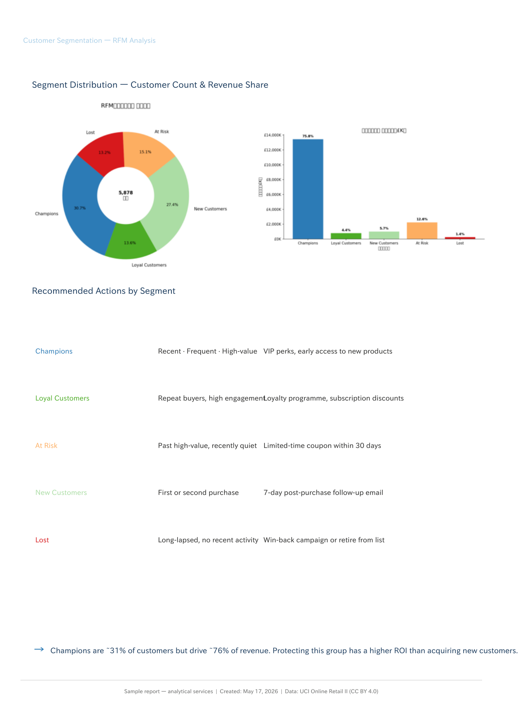

# Weekly Retail Insights — On Autopilot

## The problem

You have sales data, but no time to look at it. Most business owners glance at last month's revenue and move on. The stuff that actually matters — which products are slipping, which customers are going quiet, which weeks quietly outperform the rest — just gets missed.

---

## See it in action

This is a real sample report, built from two years of retail transaction data. It's what a client would receive in their inbox on Monday morning.

| | |
|---|---|
|  |  |

**[Download the full sample report (PDF)](output/report_sample_en.pdf)**

---

## How it works

**1. Your Data, Always Up to Date**
You connect the latest sales data, for example via Google Sheets.

**2. Automatic Analysis**
Every week, the system reads your data, analyses it, and builds the summary report and charts — revenue trends, top products, customer behaviour. No one needs to touch anything.

**3. Custom Report, automatically delivered**
A clean PDF is generated and sent to your email, Teams, or Slack — whichever you prefer. Each finding comes with a plain-language comment and a specific action to take.

---

## What you get

Each weekly report covers:

- **Revenue trend** — monthly and week-on-week, with year-on-year comparison
- **Top products** — which SKUs are driving revenue, and which are slipping
- **Customer segments** — who your best customers are, and which ones are going quiet
- **Recommended actions** — one clear next step per finding, written in plain language

---

## Frequently asked questions

**What data do I need to provide?**
An Excel or CSV file with your sales transactions — date, product, quantity, price, and customer ID. If your data looks different, get in touch and we can work it out.

**How long does setup take?**
First report is typically ready within a few days of receiving your data.

**Is the report customisable?**
Yes. The analyses, layout, language, and delivery frequency can all be adjusted to fit your business.

**How much does it cost?**
Get in touch for a quote — scope and pricing depend on your data and what you need.

---

## Interested?

Open to new clients. If you want a report built around your own data, get in touch.

**Contact:** nguyenandydevjp@gmail.com
